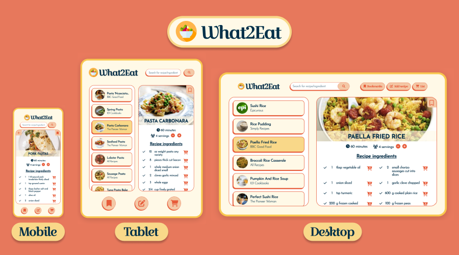

# What2Eat Web App

## Welcome! 👋

This project was based on the Forkify Web App created by Jonas Schmedtmann in his course "The Complete JavaScript Course 2022: From Zero to Expert!". I have realized his Web App was not responsive, so it was not functional on a tablet/smartphone. Therefore, I decided to recreate the project making it responsive and implementing a shopping list feature.

## Table of contents

- [Overview](#overview)
  - [The challenge](#the-challenge)
- [My process](#my-process)
  - [Built with](#built-with)
- [Author](#author)

## Overview

### The challenge

- Create a responsive Web App connected to the Forkify API.

- Features:

1. Search functionality: API Search Request
2. Results with pagination
3. Display recipe
4. Change servings functionality
5. Bookmarking functionality
6. Store bookmark data in localStorage
7. On page load, read saved bookmarks
8. Own recipe upload
9. Own recipe automatically bookmarked
10. User can only see own recipes, not from others (API key)
11. User can create shopping list for ingredients
12. Store shopping list in localStorage

## My process

### Built with

- Semantic HTML5 markup
- SASS/SCSS pre-processor
- Flexbox
- CSS Grid
- Mobile-first workflow
- Gulp Workflow for Optimization
- Vanilla JavaScript
- MVC Architecture
- REST API integration (GET and POST)

## Author

Coded by José Pessoa 🧪 💻
